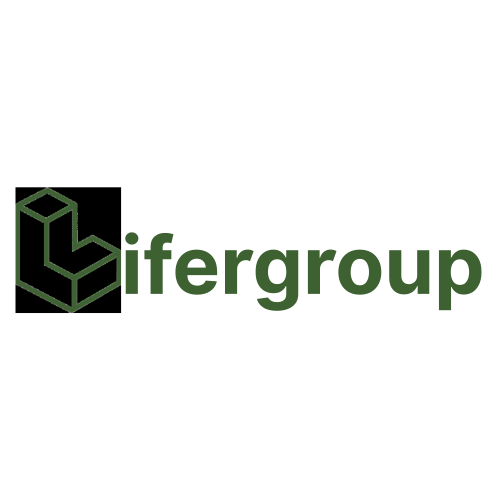

  

  

<h1 align="center">LiferGroup</h1>

  <strong>AI-native cloud infrastructure for the next generation of builders.</strong>

  <code>Build fast. Stay alive. Ship the future.</code>

 

  <a href="https://lifergroup.com">Website</a>&nbsp;&nbsp;·&nbsp;&nbsp;<a href="https://leaflow.net">Deploy</a>&nbsp;&nbsp;·&nbsp;&nbsp;<a href="https://idcjk.com">Resources</a>

  
  
  
  

 

---

 

### The Problem

Developers and small teams shouldn't need to become cloud architects before launching a product. Going from idea to running service still takes too many manual steps. We're collapsing that into one conversational, automated workflow.

 

<table>
<tr>
<td align="center" width="33%">
 
<h3>💬</h3>
<strong>Describe</strong> 
Tell us what you want to build — in natural language.
  
</td>
<td align="center" width="33%">
 
<h3>⚡</h3>
<strong>Deploy</strong> 
We match resources, generate plans, and ship it live.
  
</td>
<td align="center" width="33%">
 
<h3>🔁</h3>
<strong>Operate</strong> 
Ongoing maintenance, scaling, and optimization — handled.
  
</td>
</tr>
</table>

 

---

 

## Leafaas Ecosystem

<strong>Leaf as a Service</strong> — the unified service ecosystem of LiferGroup.

 

<table>
<tr>
<td width="33%" valign="top">
<h3>🖥️&nbsp; Leaf.as</h3>

Server marketplace. Financial-grade stability at competitive prices — dedicated servers, VPS, and cloud compute ready to deploy.

<a href="https://leaf.as"><code>leaf.as →</code></a>

</td>
<td width="33%" valign="top">
<h3>🚀&nbsp; Leaflow</h3>

AI application deployment & delivery. Deploy websites, apps, and AI services with minimal config. Less YAML, less ops, more shipping.

<a href="https://leaflow.net"><code>leaflow.net →</code></a>

</td>
<td width="33%" valign="top">
<h3>📡&nbsp; IDCJK</h3>

Infrastructure intelligence. Maps IDC suppliers, cloud resources, pricing, and supply-chain data for smarter resource decisions.

<a href="https://idcjk.com"><code>idcjk.com →</code></a>

</td>
</tr>
</table>

 

---

 

## Direction

 

> *We're exploring how AI agents, infrastructure data, and automated DevOps workflows can work together — to reduce the gap between an idea and a running service.*

 

| | |
|:--|:--|
| **AI-native delivery** | Conversational interfaces over traditional cloud consoles |
| **Infra intelligence** | Real-time supply-chain & pricing data for smarter allocation |
| **Agent-driven ops** | Deployment, monitoring, and scaling handled by AI workflows |
| **Global acceleration** | Network capabilities optimized for cross-border AI access |
| **Server marketplace** | Financial-grade stability at competitive prices, ready to deploy |

 

---

 

  <strong>Build fast. Stay alive. Ship the future.</strong>

  A young AI infrastructure team from Hong Kong & the Greater Bay Area. Product design · Full-stack engineering · AI infra · Startup execution.

 

  &nbsp;
  

 

  

